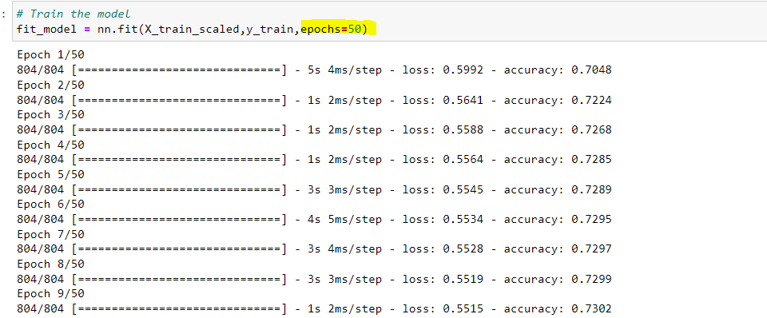

1. **Overview** of the analysis: 

The assignment required a Deep Learning Model to predict if applicants for funding will be successful or not. Application of this model allowed it to reach an accuracy of just over 73% which can be considered a good model.

2. **Results**: Using bulleted lists and images to support your answers, address the following questions.

In the starter code the accuracy achieved was = 72.69%

For the 1st optimization, the number of Epochs were reduced from 100 to 50. This improved the accuracy to = 73%

For the 2nd optimization, 2 more hidden layers were added and the number of Epochs was increased to 150. This further improved the accuracy to = 73.07%

For the 3rd and last optimization, the "USE_CASE" feature was dropped. Hidden layers were similar to the 2nd optimization, however the number of Epochs was increased to 200. This resulted in a decrease in accuracy = 72.5%

  * **Data Preprocessing**
    **What variable(s) are considered the target(s) for your model?**

"IS_SUCCESSFUL" was considered a target for this model; to determine if the funding would be successful or not.
   
   **What variable(s) are considered to be the features for your model?**
All other columns in the dataframe, other than "IS_SUCCESSFUL" were considered features for the model.

   **What variable(s) are neither targets nor features, and should be removed from the input data?**
The identification data such as "EIN" and "NAME" columns were considered neither features or targets and were removed for this model.

 * **Compiling, Training, and Evaluating the Model**

    **How many neurons, layers, and activation functions did you select for your neural network model, and why?**
Initially I selected 2 hidden layers and an output layer to evaluate the accuracy of the model.
Then I optimised by adjusting the Epoch numbers and increasing the hidden layers to see if it affected the model.
   
   **Were you able to achieve the target model performance?**
No, I did see an improvement, but I did not achieve an accuracy close to 75%

   **What steps did you take to try and increase model performance?**
I increased the number of Epochs to train the model further. I also added more layers.

3. **Summary**: Summarize the overall results of the deep learning model. Include a recommendation for how a different model could solve this classification problem, and explain your recommendation.

Overall I would say the model worked well. Some more tweaks with the data and the model itself could increase the accuracy of the required results. I would say a supervised learning model would also be ideal for this activity, as we have the data to train and test for predictions.

